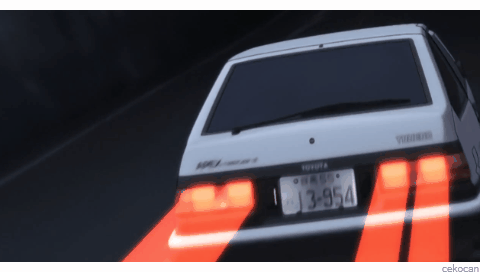
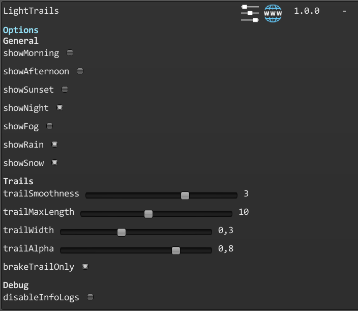

# Light Trails

A mod for Art of Rally adding light trails for brake lights similar to the ones in Initial D.

#### Launcher Support

#### Platform Support

## Usage

Press Ctrl + F10 to open the mod manager menu.\
Adjust settings to select when and how the trails will be displayed.\

By default, the mod displays brakelight trails on night, rain and snow weathers, only when you brake.

### General

- **showMorning** : will enable the light trails on the "Morning" weather.
- **showAfternoon** : will enable the light trails on the "Afternoon" weather.
- **showSunset** : will enable the light trails on the "Sunset" weather.
- **showNight** : will enable the light trails on the "Night" weather.
- **showFog** : will enable the light trails on the "Fog" weather.
- **showRain** : will enable the light trails on the "Rain" weather.
- **showSnow** : will enable the light trails on the "Snow" weather.

### Trails

- **trailSmoothness** : will adjust how smooth the trail will be.
- **trailMaxLength** : will change the maximum length of the trail.
- **trailWidth** : will change the width of the trail.
- **trailAlpha** : will change the transparency of the trail.
- **brakeTrailOnly** : will only spawn light trails when the player brakes.

Disabling the mod in the manager will hide all trails by default.

## Installation

Follow the [installation guide](https://www.nexusmods.com/site/mods/21/) of
the Unity Mod Manager.\
Then simply download the [latest release](https://github.com/MMike17/ArtOfRally_LightTrails/releases/latest)
and drop it into the mod manager's mods page.

## Showcase

